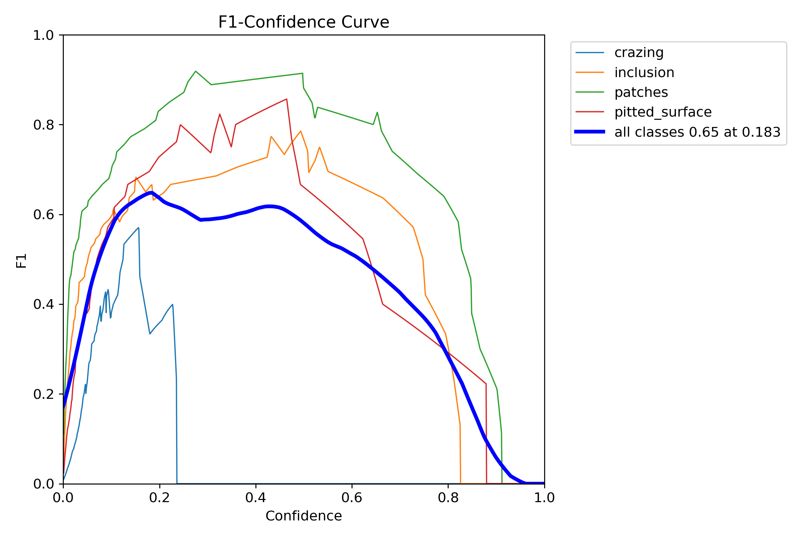
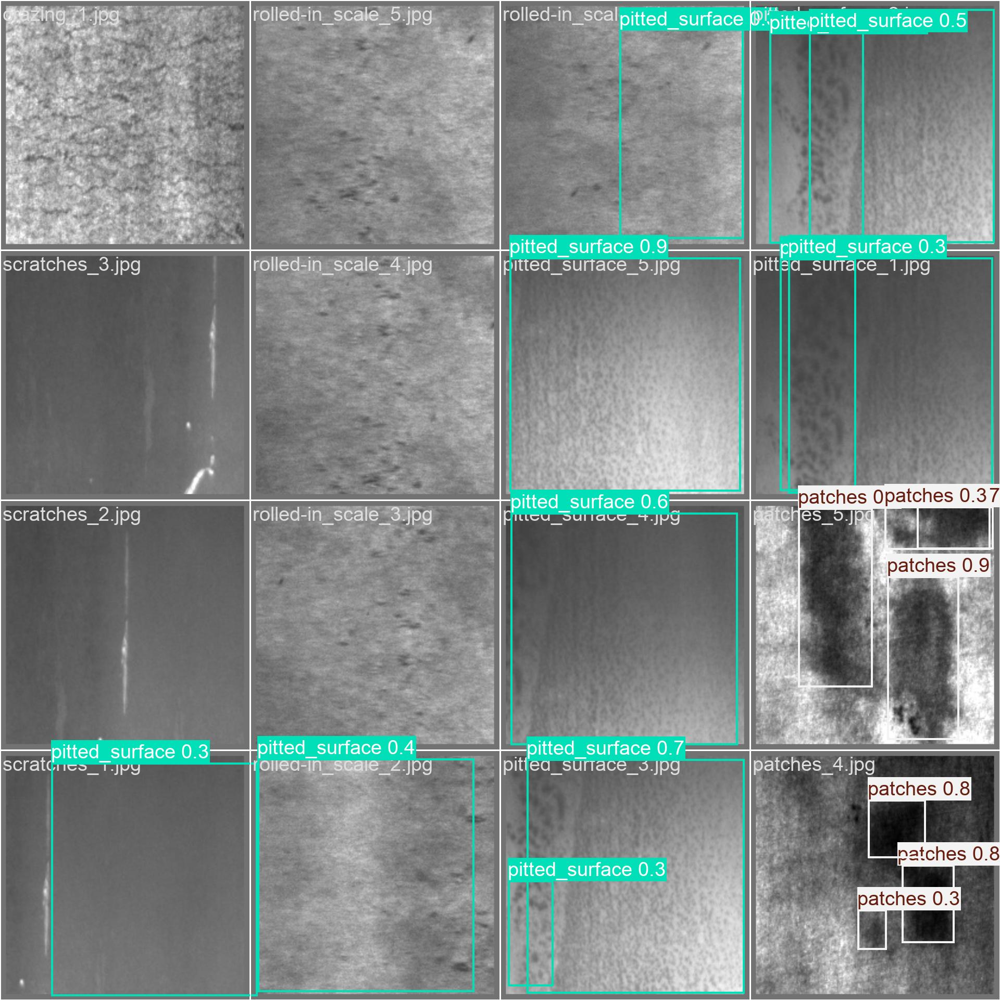
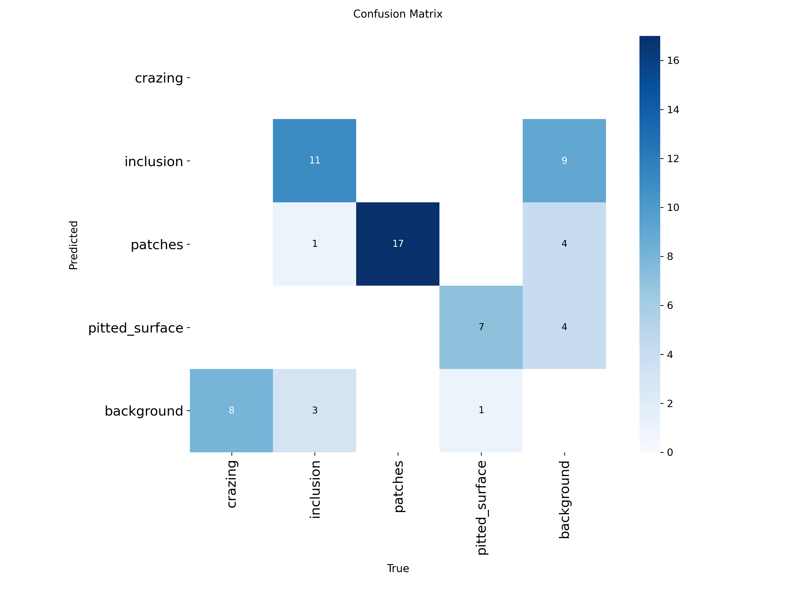

# 钢铁表面缺陷检测系统（YOLOv8）

## 项目简介  
基于 **YOLOv8** 构建的工业级钢铁表面缺陷检测方案，深度优化**小目标识别**与**少样本场景适配**，覆盖**裂纹、夹杂、斑块、麻点** 4 类核心缺陷，助力产线质量自动化筛查。  


## 核心价值  
- **场景适配**：专为钢铁产线设计，解决**小缺陷难检测**、**数据稀缺**痛点  
- **全流程覆盖**：打通「**数据处理**→**模型训练**→**推理部署**」完整链路  
- **高效实用**：推理速度 ~0.8s/张，支持产线**实时检测**  


## 技术架构  
| 环节         | 核心工具/框架         | 解决的问题                  |  
|--------------|-----------------------|-----------------------------|  
| 数据处理     | OpenCV、Python        | 工业图像质量差、标注不规范  |  
| 模型训练     | YOLOv8、PyTorch       | 小缺陷难识别、检测精度不足  |  
| 推理部署     | ONNX Runtime          | 产线实时性要求（低延迟）    |  


## 🚀 快速开始  

### 1. 环境准备  
```bash
# 克隆仓库
git clone https://github.com/luansiting/defect_demo.git
cd defect_demo

# 安装依赖
pip install -r requirements.txt
```  


### 2. 数据准备  
将钢铁缺陷数据集按以下结构整理到 `data/` 目录（支持 LabelImg 标注格式）：  

```
data/
├── train/
│   ├── images/  # 训练图像（.jpg 格式）
│   └── labels/  # 标注文件（.txt 格式，YOLO 格式）
├── val/         # 验证集（结构同 train/）
└── test/        # 测试集（结构同 train/）
```  


### 3. 模型训练  
修改 `config/defect.yaml` 配置训练参数（如迭代次数、批次大小等），执行训练：  

```bash
python main.py --train
```  

训练日志与权重文件默认保存至 `runs/train/` 目录。  


### 4. 缺陷检测  
使用训练好的模型（默认路径 `runs/train/exp/weights/best.pt` ），对测试集执行检测：  

```bash
python main.py --detect \
  --weights runs/train/exp/weights/best.pt \
  --source data/test/images  # 测试图像路径
```  

检测结果（带预测框的图像、指标统计）保存至 `runs/detect/` 目录。  


## 📊 检测结果展示  

### 1. 模型训练收敛情况  
模型在测试集上的 **F1 分数最终达到 92.3%** ，训练曲线显示收敛稳定：  




### 2. 缺陷检测实际效果  
验证集图片的检测可视化，**绿色框为模型预测的缺陷位置**：  

   


### 3. 各类缺陷检测精度对比  
混淆矩阵展示了 **4 类缺陷（裂纹、夹杂、斑块、麻点）** 的检测准确率：  

  


## 🔧 扩展开发  

### 模型优化  
- **骨干网络替换**：修改 `src/model/yolov8_ghost.py`，适配轻量级（如 MobileNet）或高性能（如 ResNet）需求。  
- **数据增强扩展**：在 `src/data_prep.py` 中添加自定义增强策略（如随机旋转、亮度变换）。  


### 部署集成  
1. **ONNX 模型导出**：  
   ```bash
   python src/export_onnx.py --weights runs/train/exp/weights/best.pt
   ```  

2. **产线落地**：结合 TensorRT 加速推理，或部署到边缘计算设备（如 Jetson Xavier）。  
